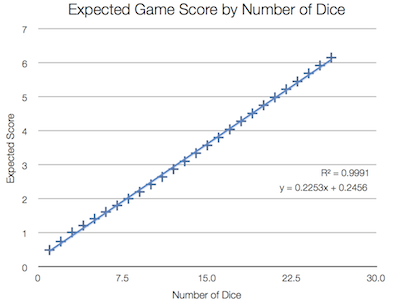

Chicken
=====================

Chicken is a solver for the game "[Martian Dice][md]"

#What it does

It suggests the move with the highest expected score outcome. Here are some examples:

*	You have picked 6 Chickens, 3 Tanks, and 3 Lasers with one dice remaining.
	Should you roll or end the game?
	
		>> ruby chicken.rb CCCCCCTTTLLL 1
		You should [:endGameMove] for an expected score of 6.0
	
*	You are starting the game with 13 dice in hand. 
	What is the average result?
	
		>> ruby chicken.rb - 13
		You should [:rollDiceMove] for an expected score of 3.11

*	You have previously picked 5 Chickens, and rolled 4 Lasers and 4 Humans.
	Is it better to pick the Humans for a chance of a really high score or is it better to pick the Lasers to play it safe?

		>> ruby chicken.rb CCCCC LLLLHHHH
		You should [:saveHumansMove] for an expected score of 9.23

#How the game changes with more dice 

The expected score increases linearly with more dice.

[md]: http://boardgamegeek.com/boardgame/99875/martian-dice  "Martian Dice"

